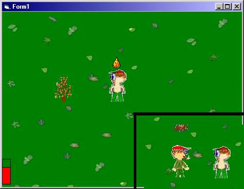



## The Quest For Redemption RPG game \(updated\)

### Description

Updated on 19 Feb. I am 14 years old and wanted to make a cool RPG game, complete with graphics and missions and extensively commented, read readme.txt please. Scrolling view like in Diablo. Includes trees, rocks and other obstacles. 3 missions, health meter, spells. Teaches you collision detection, transparent images, moving images smoothly with the keybord, other tips and tricks for game programming. I think this project is good to learn something out of.
 
### More Info
 

             |
---                |---
**Submitted On**   |2003-02-17 18:15:24
**By**             |[Jonathan Dowling](https://github.com/Planet-Source-Code/PSCIndex/blob/master/ByAuthor/jonathan-dowling.md)
**Level**          |Intermediate
**User Rating**    |4.3 (26 globes from 6 users)
**Compatibility**  |VB 6\.0
**Category**       |[Games](https://github.com/Planet-Source-Code/PSCIndex/blob/master/ByCategory/games__1-38.md)
**World**          |[Visual Basic](https://github.com/Planet-Source-Code/PSCIndex/blob/master/ByWorld/visual-basic.md)
**Archive File**   |[The\_Quest\_1547022192003\.zip](https://github.com/Planet-Source-Code/jonathan-dowling-the-quest-for-redemption-rpg-game-updated__1-43022/archive/master.zip)

